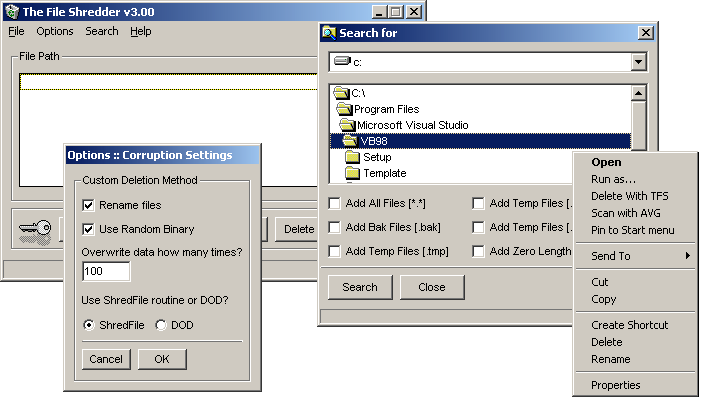



## The File Shredder 3\.1

### Description

TFS 3.11 will take any number of files - you can even right click a file and select 'Delete With TFS' - and overwrite them with random binary data up to several hundred times. The data overwrites every character in the file, so it is secure, but a bit slow. I've also included the DOD routine by Michael Bos as an alternate method of deletion. Also features a progress bar to show the deletion status and can scan drives for temp files.
 
### More Info
 

             |
---                |---
**Submitted On**   |2002-08-22 16:47:34
**By**             |[boltfishy](https://github.com/Planet-Source-Code/PSCIndex/blob/master/ByAuthor/boltfishy.md)
**Level**          |Advanced
**User Rating**    |5.0 (10 globes from 2 users)
**Compatibility**  |VB 6\.0
**Category**       |[Files/ File Controls/ Input/ Output](https://github.com/Planet-Source-Code/PSCIndex/blob/master/ByCategory/files-file-controls-input-output__1-3.md)
**World**          |[Visual Basic](https://github.com/Planet-Source-Code/PSCIndex/blob/master/ByWorld/visual-basic.md)
**Archive File**   |[The\_File\_S1220018242002\.zip](https://github.com/Planet-Source-Code/boltfishy-the-file-shredder-3-1__1-38158/archive/master.zip)

